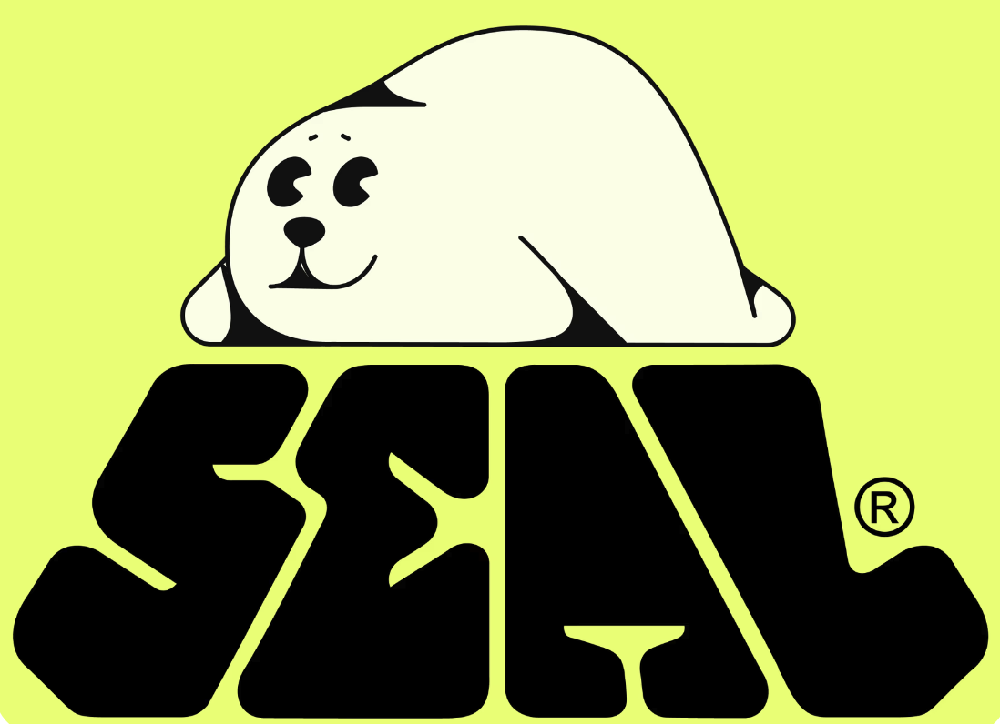

# Awesome Seal 

> A curated list of _awesome_ tools and projects within the Seal ecosystem.

[Seal](https://github.com/MystenLabs/seal/) is programmable access control for Web3 — secure, composable, and threshold-based.

> [!NOTE]
> The projects and tools listed in this repository are provided as community-curated examples of how Seal can be used in real-world solutions or alongside complementary tools. Inclusion in this list does not imply endorsement by Mysten Labs.
>
> Mysten Labs does not make any guarantees regarding the quality, security, reliability, or ongoing maintenance of the listed projects. Users are encouraged to review and assess each project independently before use. Any use of these tools is done at your own discretion and risk.

[**Submit your own developer tool here**](CONTRIBUTING.md)

## Tools and Projects

- [Decryptable Move Enum](https://github.com/studio-mirai/decryptable) - A Sui Move package implements a `Decryptable` enum which stores a decryptable piece of data. Recommends Seal for encryption.
- [Dominion Lancer](https://lancer.dominion.zone/) - [Github repo](https://github.com/dominion-zone/dominion-lancer): A secure and confidential platform for responsible vulnerability disclosure on the Sui blockchain. Submit exploits via trusted enclaves, generate verifiable evidence, and enable safe, onchain researcher rewards.
- [Epoch One](https://epoch-one.vercel.app/) - [Github repo](https://github.com/T-adero1/epoch_one): EpochOne E-Sign is a cutting-edge contract management platform that combines traditional e-signature capabilities with blockchain technology. Create, manage, and sign contracts with cryptographic security and decentralized storage.
- [Zeroleaks](https://www.zeroleaks.xyz/) - [Docs](https://zeroleaks.notaku.site/): ZeroLeaks is a secure, anonymous, and verifiable whistleblowing platform built on the Sui blockchain. It uses zero-knowledge proofs to protect whistleblowers while proving the authenticity of leaked documents.
- [Sui Shadow](https://sui-shadow.vercel.app/) - [Github repo](https://github.com/Sahilgill24/SuiShadow): Sui Shadow is a privacy-first art platform on Sui where artists encrypt hidden artworks into NFTs using Seal-powered access control. Encrypted chunks are stored off-chain in Walrus, and collectors unlock them post-purchase for a secure, suspenseful reveal.
- [Passman](https://passman-six.vercel.app/) - [Github repo](https://github.com/dam2onkid/passman): Passman is a decentralized password manager built on Sui, secured with Seal encryption technology. It gives users full control over their passwords without relying on any central authority.
